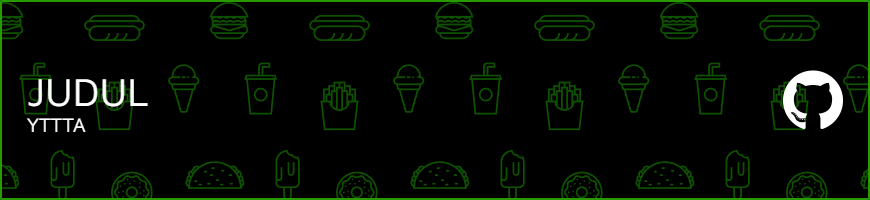

 

###

<h1 align="left">Hey teman 👌</h1>

###

Nama saya auraauvarose

###

<h2 align="left">Aku sedang mendalami dunia programing dari dasar, ini adalah github pertama saya.</h2>

###

🎯 Goals: .Menjadi seorang yang bermanfaat 🎲 How: Apanya?

###

<h2 align="left">I code with</h2>

###

###

  
  
  
  
  
  
  
  
  
  
  
  
  
  
  

###

        

###

## 🌐 Socials:
   

###

### ✍️ Random Dev Quote

###