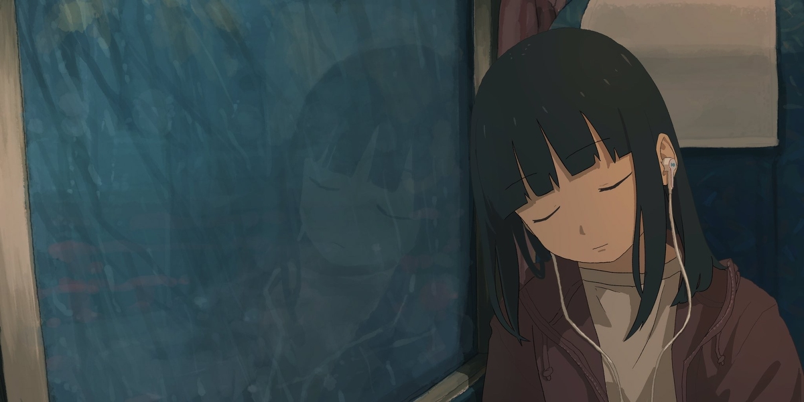

  
   
   
   
  

    Wake up • eat • sleep
  

## 🌙 About

Digital craftsman passionate about creating elegant, immersive experiences. Specializing in full-stack development, cinematic animations, and visual design. Deep diver into Linux ecosystems, creative coding, and the intersection of art and technology.

### 🎯 Frontend Development

### ⚙️ Backend & Databases

### 🎬 Creative & Design

### 🔧 Tools & Infrastructure

🚀 Currently Exploring

- 🎮 Interactive experiences with WebGL
- 🖥️ Linux desktop environment optimization

💾 Interests & Hobbies

Gaming (Minecraft • Roblox) • Music production • Linux customization

Life is a river, winding and deep,With banks of sorrow and valleys of steep. We start as a drop, so fragile and small,Learning to rise, and learning to fall. Through seasons of sunshine, through tempests of gray,We carry our dreams, not knowing the way. The mountains are high, the forests are dense,But courage within is our only defense.We meet many faces, we walk many miles, Some bring us teardrops, and some bring us smiles.In every encounter, a lesson is learned, A page in the book that can never be returned.The stars in the night will guide us along, When the road is too dark and the wind is too strong. Hold fast to your hope, let your spirit be free,For the journey of life is a vast, open sea. It is not about reaching the end of the shore, But the beauty we find in the moments before. So breathe in the morning, embrace every stride, With faith as your compass, and love as your guide.

## 📫 Connect & Collaborate

**Let's create something amazing together**

  

  <i>✨ Win ✨</i>
    
  Made with ❤️ • Last updated: 2025

